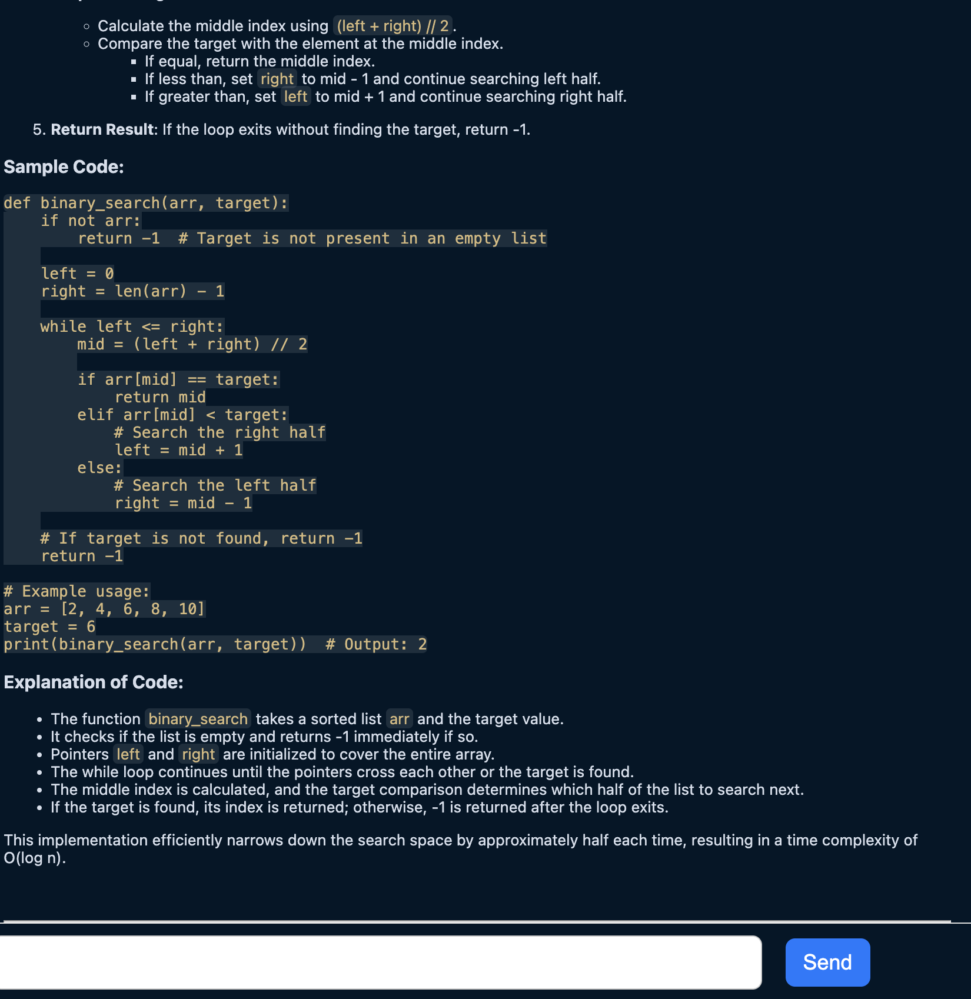

# DeepChat
**v 1.0.4**

**DeepChat** is a VS Code extension that integrates with the **Ollama API** and provides seamless AI-powered conversations using the **DeepSeek-R1** model. This extension is designed to help developers and users interact with AI directly within the VS Code environment with minimal setup.

## Features
- **Interactive Chatbot UI**: Provides an easy-to-use chatbot interface for conversational AI, similar to ChatGPT, directly within VS Code.
- **Model Selection**: Switch between different model sizes (1.5b, 8b, 32b) depending on your system's resources and needs.
- **Automatic Model Management**: The extension automatically downloads models if not already present, but requires initial setup for **Ollama**.
- **Background Operation**: The extension uses the VS Code command palette to manage and interact with the chatbot, while running Ollama in the background.

## Requirements installation
### Installing ollama
1. Go to [the ollama download page](https://ollama.com/download) and download ollama for your system.
2. Pull one of the three models using `ollama pull deepseek-r1:<1.5b|8b|32b>`
Choose one of the following model sizes based on your system’s capabilities:
- `1.5b`: Smallest and most resource-friendly.
- `8b`: Balanced size for most systems.
- `32b`: Largest and most powerful, requiring more system resources.

**Note**: The model download may take some time depending on your internet speed and the size of the model and can also take up some disk space.

### Installing the extension
1. Press `Cmd + P` or `Ctrl + P` depending on your platform.
2. Type in or paste in `ext install deepchat-r1` and press `Enter`. This will open the extension sidebar and you'll be able to just hit install.

## Usage
Once you've finished installing all the requirements you can start chatting.

1. Open the command pallete using `Cmd + Shift + P` or `Ctrl + Shift + P` depending on your system.
2. Type in `DeepChat: Set <1.5b/8b/32b>` depending on what model you've pulled and hit enter.
3. Open the command pallete again and type in `DeepChat: Open chat`. This will open a sidebar with the chat.

You can also pull multiple models and play around with them. You can change them using `DeepChat: Set <1.5b/8b/32b>` in the command palette.

The selected model will be used for the next message you send.

## How It Works
- DeepChat uses the Ollama API to handle the running of models locally on your machine.
- Once you’ve downloaded a model, all interactions are processed on your computer, providing a fast, private experience.
- The extension interacts with Ollama to download, run, and switch between models as needed.

## Troubleshooting
- Model Download Issues: If the model isn’t downloading, ensure your internet connection is stable and try running the ollama pull command again.
- Slow Responses: If the AI responds slowly, consider switching to a smaller model like 1.5b if you’re running on a resource-constrained system.
- Ollama Not Running: If you encounter any issues, make sure that Ollama is running in the background. 

## Common Commands
- Open the Chat: Press `Cmd + Shift + P` (macOS) or `Ctrl + Shift + P` (Windows/Linux), then type `deepchat: Open Chat` and press Enter.
- Switch Models: Press `Cmd + Shift + P` (macOS) or `Ctrl + Shift + P` (Windows/Linux), then type `deepchat: Set 1.5b/8b/32b` and press Enter.

## Future Features
- I am currently building on code autocompletion like with using Tabnine. It might still take a while but I am actively working on this project.
- I don't have many ideas so if you want to request a feature or report a bug, please go to [the github page](https://github.com/plainprince/deepchat/) and do it there. Thanks!
